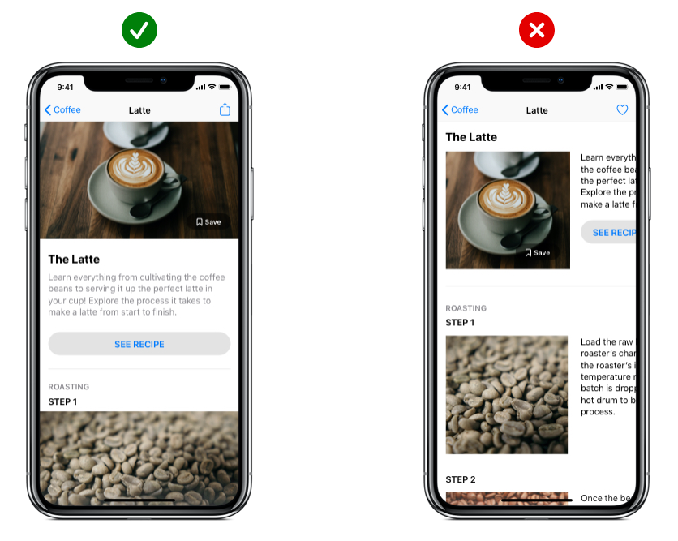
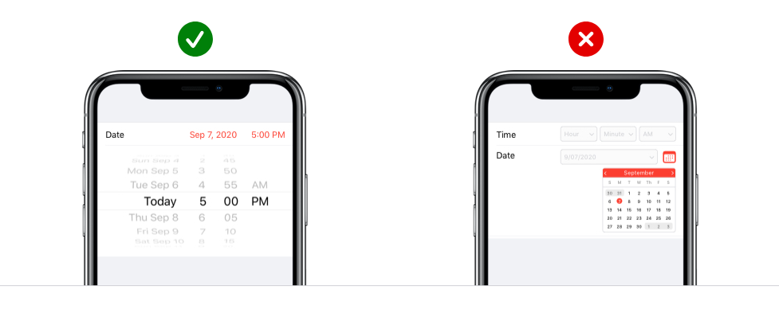
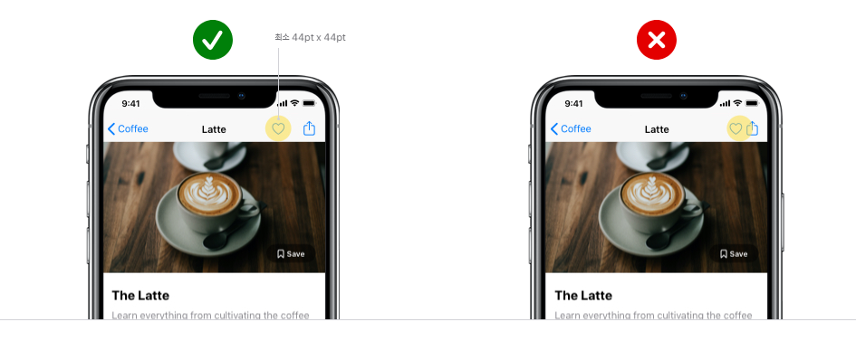
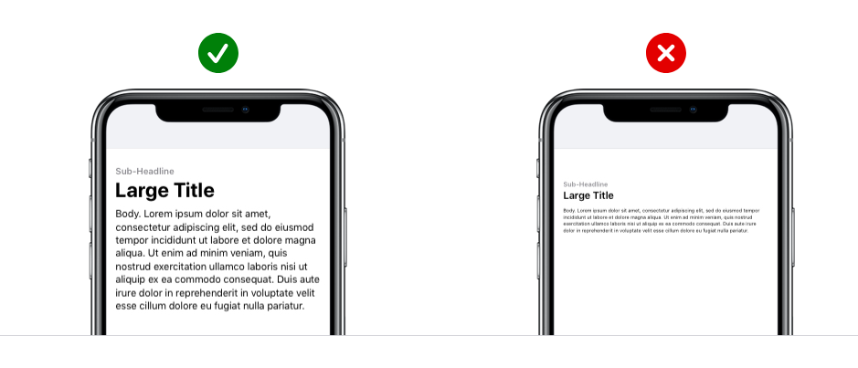
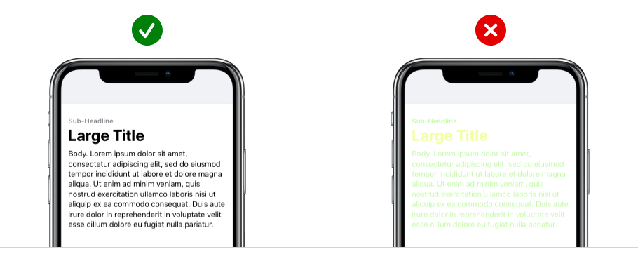
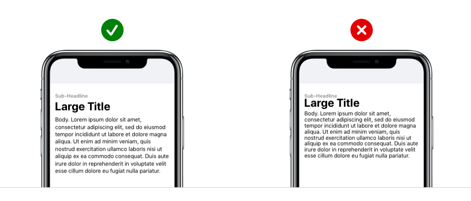
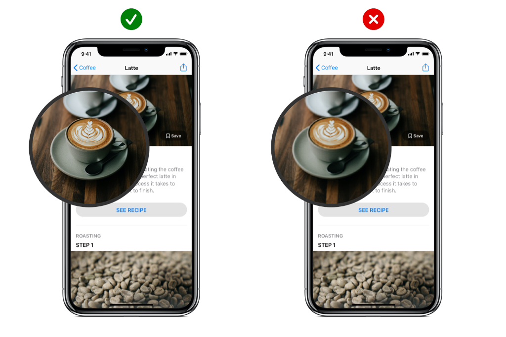
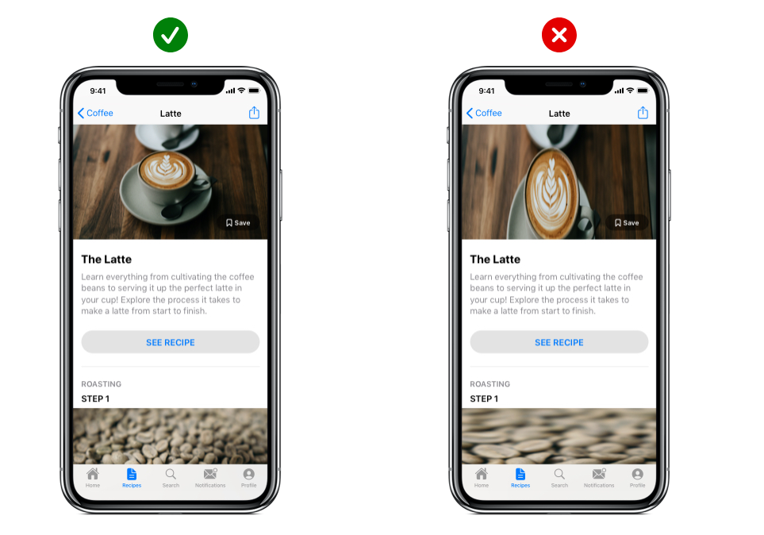
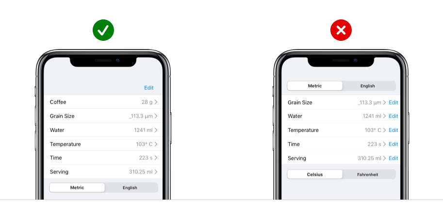
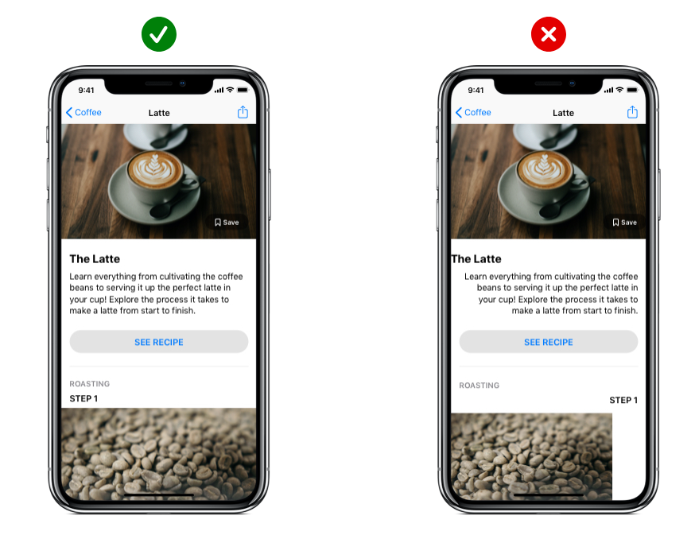

# UI 디자인

- UI (User Interface) 디자인은 사용자가 제품을 어떤 방식으로 이용하도록 만드느냐를 디자인하는 것입니다. 즉, 겉으로 시각화되는 작업이라고 보시면 됩니다. 사용자가 실제로 마주하게 될 디자인, 레이아웃 등을 아우르는 개념입니다.

 
 

## 1. GUI 디자인 콘셉트 도출하기

### 1-1. UI 디자인 기본 원칙

- 매력적인 사용자 경험을 통해 견고한 인터페이스 디자인을 기반으로 깔끔하고 효율적이며, 심미성이 묻어 나올 수 있도록하는 디자인으로 상호 작용성, 가독성, 그래픽, 명확성을 고려하는 디자인 원칙

 

#### 1-1-1. 상호 작용성

##### 콘텐츠 형식 지정

- 기기 화면에 맞는 레이아웃을 생성하십시오. 사용자가 기본 콘텐츠를 확대/축소 또는 가로로 스크롤하지 않고 볼 수 있어야 합니다.

 

##### 터치 제어기

- 터치 동작을 위해 설계된 UI 요소를 사용하여 앱과의 상호 작용이 쉽고 자연스럽게 느껴지도록 합니다.

 

##### 대상 탭하기

- 손가락으로 정확하게 탭할 수 있도록 크기가 최소 44pt x 44pt인 제어기를 생성하십시오.

  

#### 1-1-2. 가독성

##### 텍스트 크기

- 텍스트 크기를 11포인트 이상으로 하여 일반적인 거리에서 화면을 확대하지 않고도 텍스트가 선명하게 보일 수 있게 합니다.

 

##### 대비

- 텍스트가 선명하게 보이도록 서체 색상과 배경 간에 대비가 명확해야 합니다.

 

##### 간격

- 텍스트가 겹치지 않도록 하십시오. 행 높이와 문자 간격을 늘려 가독성을 향상할 수 있습니다.

  

#### 1-1-3. 그래픽

##### 고해상도

- 모든 이미지 애셋의 고해상도 버전을 제공하십시오. @2x 또는 @3x가 아닌 이미지는 Retina 디스플레이에서 흐릿하게 나타납니다.

 

##### 왜곡

- 항상 의도한 가로 세로 비율로 이미지를 표시하여 왜곡을 방지하십시오.

  

#### 1-1-4. 명확성

##### 구성

- 제어기를 수정하는 콘텐츠 가까이에 배치하여 읽기 쉬운 레이아웃을 생성하십시오.

 

##### 정렬

- 텍스트, 이미지, 버튼을 정렬하여 사용자에게 정보의 연관성을 보여 주십시오.

  

### 1-2. 디자인 구성 요소1 - 컬러(Color)

  

### 1-3. 디자인 구성 요소2 - 타이포그래피(Typograph)

  

### 1-4. 디자인 구성 요소3 - 레이아웃(Layout)

  

### 1-5. 디자인 구성 요소4 - 아이콘&심볼(Icon&Symbol)

  

### 1-6. 디자인 방향성 설정

  

### 1-7. 디자인 및 시각적 요소 도출

 
 

## 2. GUI 디자인 요소 선정 및 시안 작성

### 2-1. GUI 디자인 요소의 종류

  

### 2-2. GUI 디자인 레이아웃 선정

  

### 2-3. GUI 디자인 컬러 선정

  

### 2-4. GUI 디자인 폰트 선정

  

### 2-5. GUI 디자인 시안 작성

  

 
 